<h1>DC:1 VulnHub Walkthrough</h1>

This is a walkthrough of the DC:1 virtual machine from VulnHub. It’s a beginner-friendly boot-to-root machine designed to test your penetration testing skills, especially in web exploitation. The target uses a vulnerable version of Drupal CMS, which is the main attack vector.

<h2>🔍 Initial Reconnaissance</h2>

<h3>Network Discovery</h3>

We start by identifying the IP address of the target machine using <code>netdiscover</code>.

<pre>
sudo netdiscover -i hostname
</pre>
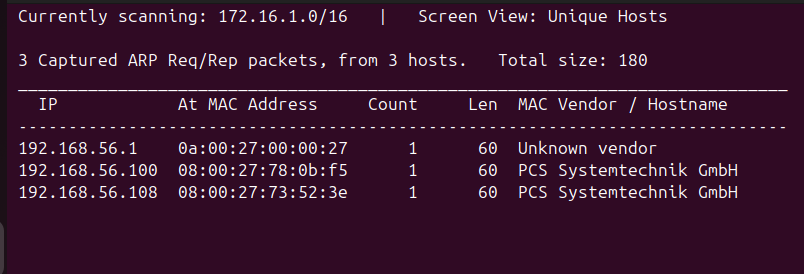

<h3>Port Scanning with Nmap</h3>

Next, we scan the target using <code>nmap</code> to find open ports and services.

<pre>
sudo nmap -sC -sV 192.168.56.108
</pre>
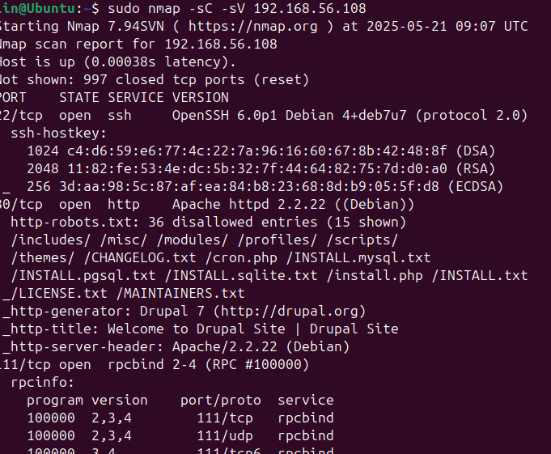

<h2>🌐 Web Application Enumeration</h2>

<h3>Drupal Site Detected</h3>

Browsing to the IP address reveals a Drupal website. This suggests a possible exploit path.

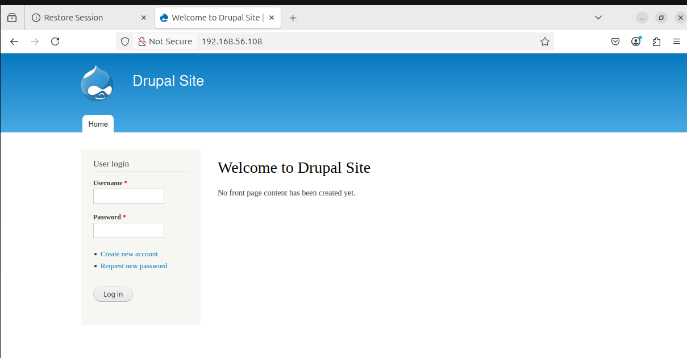

<h3>Recovering Password</h3>

Drupal has a password reset feature which may expose usernames or other useful information.

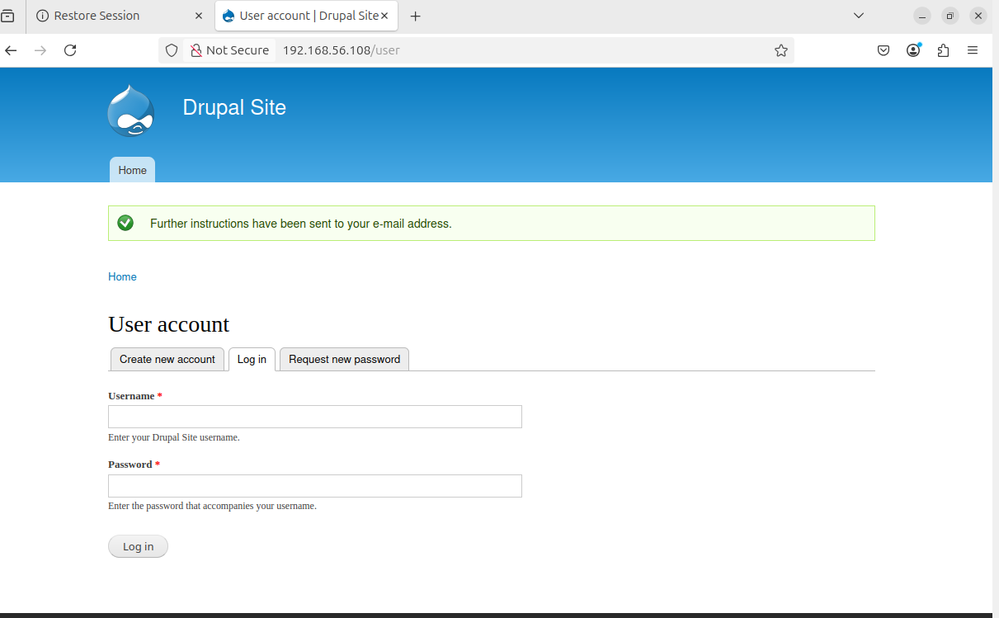

As you can see, when trying to recover the password for user names "admin". There is a success message, meaning that an admin user does exits.

<h2>🛠 Exploitation</h2>

<h3>Using Searchsploit to Find Exploits</h3>

We search for known vulnerabilities in Drupal using Searchsploit. A remote code execution (RCE) vulnerability is found.

<pre>
searchsploit Drupal -www
</pre>
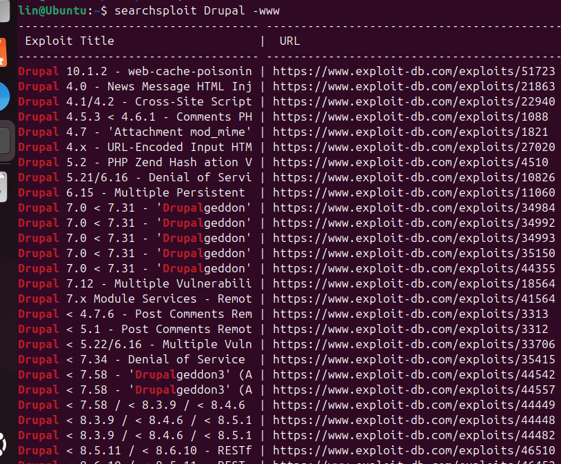

<h3>Launching Exploit via Metasploit</h3>

We use Metasploit's module for Drupalgeddon2 to exploit the vulnerability and gain a reverse shell.

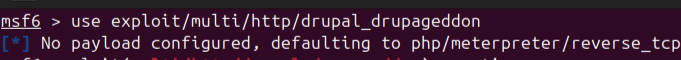

<h3>Setting the RHOST Parameter</h3>
<pre>
set RHOST 192.168.56.108
</pre>
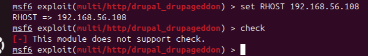

<h3>Getting a Meterpreter Session</h3>

Successful exploitation results in a Meterpreter session, gaining us remote access to the server.

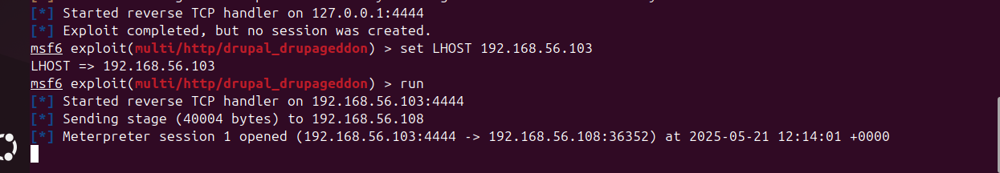

<h3>Post Exploitation - User Info</h3>

Check which user we are logged in as by using <code>getuid</code>.

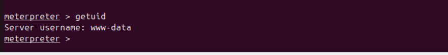

<h2>🧾 Flag Collection</h2>

<h3>Flag 1</h3>

We list files in the home directory and retrieve the first flag.

<pre>
ls
cat flag1.txt
</pre>
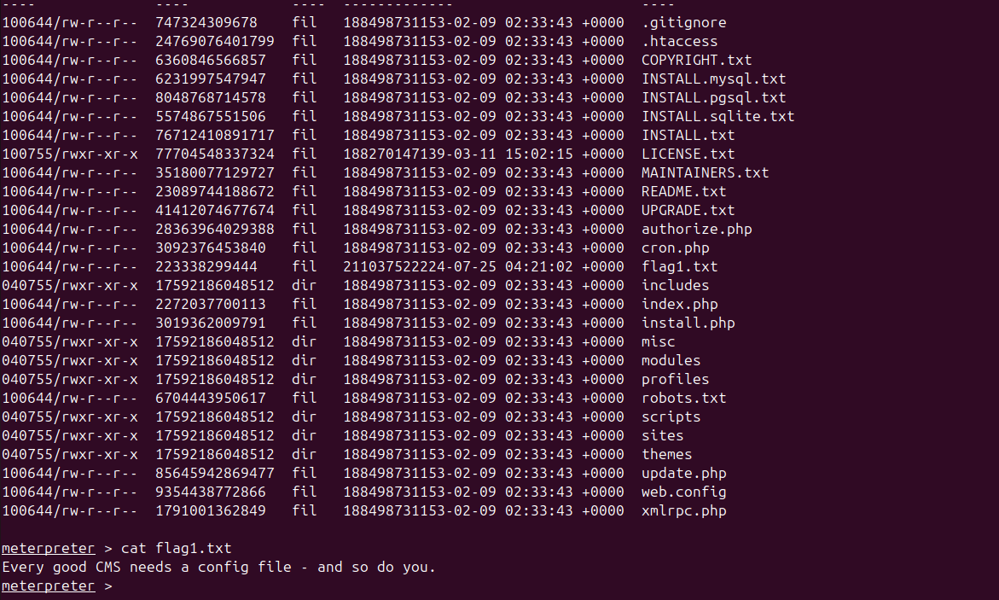

<h3>Finding Flag 4</h3>

Just to have a quick look at /etc/passwd to find any useful information there.

<pre>
cat /etc/passwd
</pre>
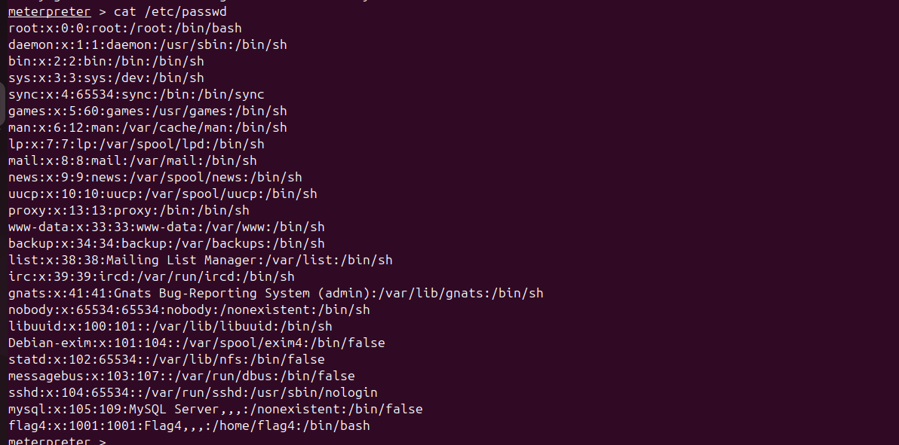

  We find that there exists a flag4. Let's have a loook.

<h3>Viewing Flag 4</h3>
<pre>
cd /home/flag4
ls
cat flag4.txt
</pre>
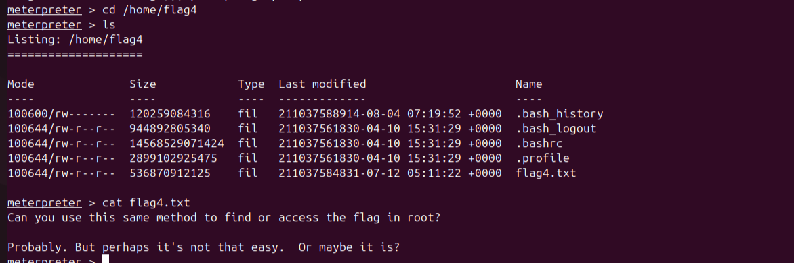

  We find that there is still more to be found.

<h2>🧩 Drupal Database Analysis</h2>

<h3>Drupal Configuration</h3>

After some research I found that Drupal stores there settings file in /sites/default/setttings.php. We search for Drupal database credentials in settings.php.

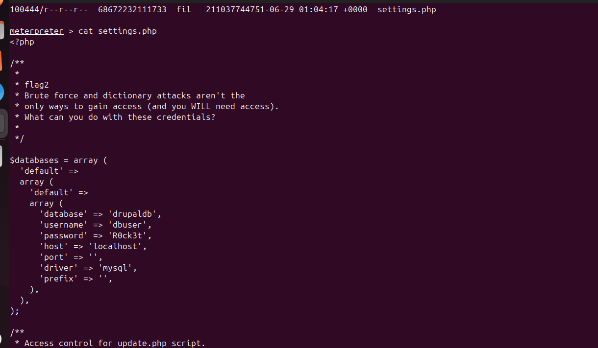

  We find some credentials for Drupal's database.

<h3>Accessing MySQL</h3>

We log into MySQL using the credentials found.

<pre>
mysql -u dbuser -p
</pre>
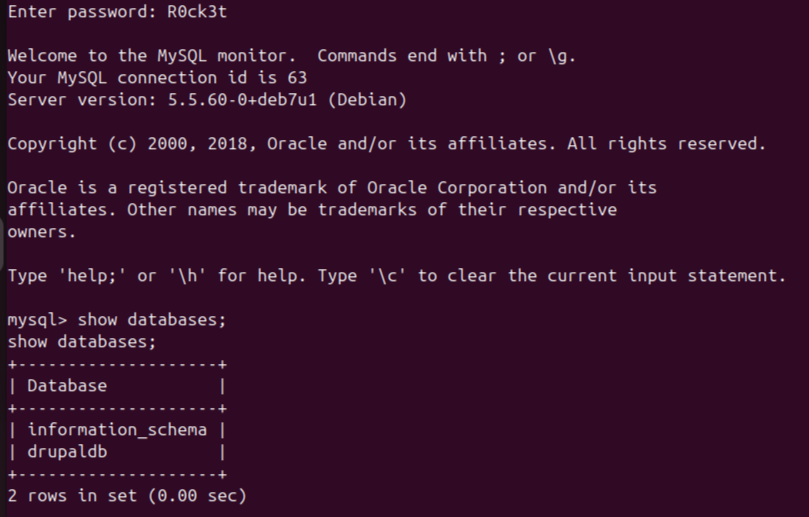

<h3>Enumerating Users Table</h3>

We look at the <code>users</code> table to see the account information.

<pre>
SELECT * FROM users;
</pre>
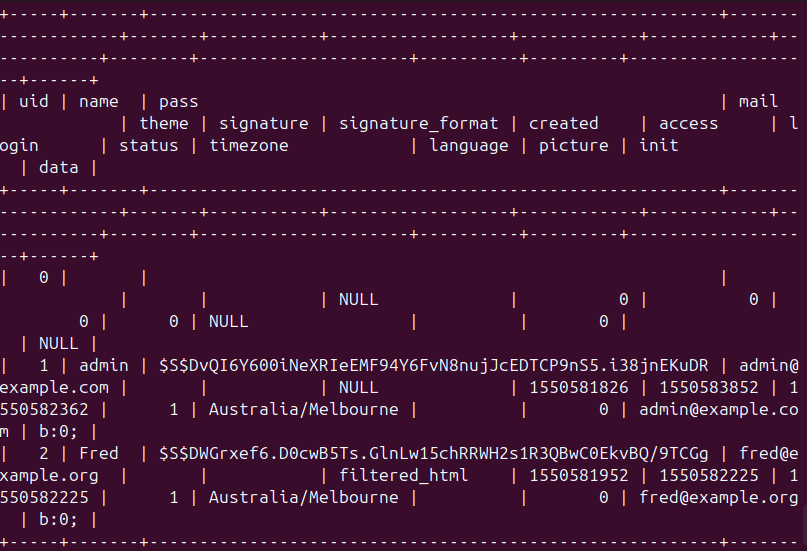

<h3>Inspecting Node Table</h3>

View any hidden content nodes stored in the Drupal site.

<pre>
SELECT * FROM node;
</pre>
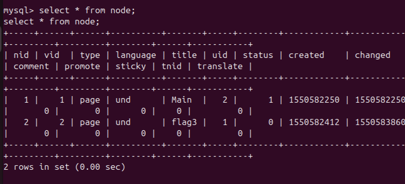

  We find flag 3. It tells us that we need to use special PERMS. We will need to us <code>-exec</code>.

<h2>🔓 Privilege Escalation</h2>

<h3>Find Has Root Permissions</h3>

Running <code>sudo -l</code> reveals that the <code>find</code> command can be executed as root.

<pre>
sudo -l
</pre>
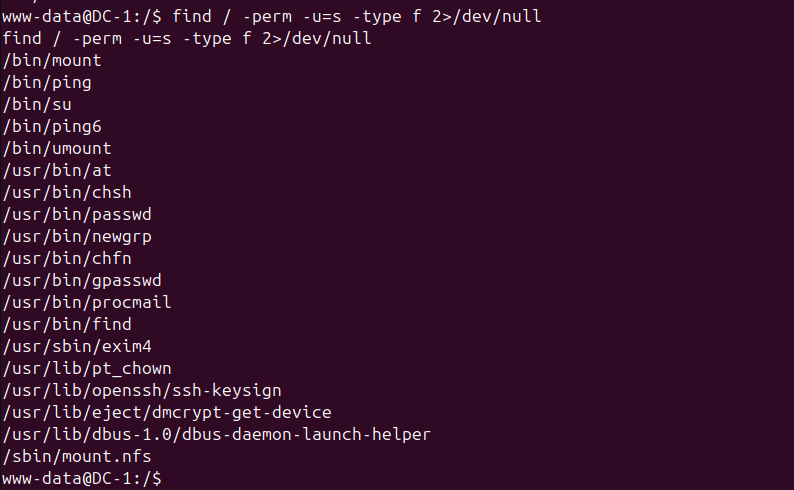

<h3>Spawning a Root Shell</h3>

We use a known privilege escalation trick with <code>find</code> to get root access. Let's see what is in the root directory.

<pre>
find root/
</pre>
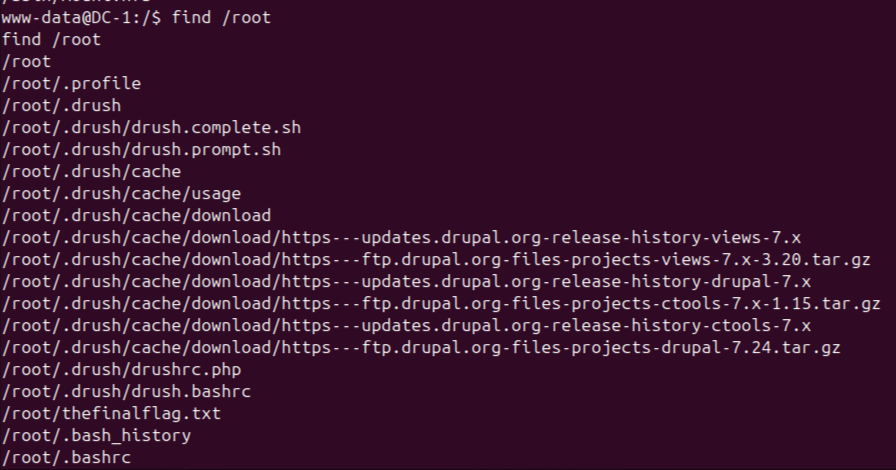

  There it is, the final flag.

<h3>Final Flag</h3>

After getting root access, we find and read the final flag. Let's use that <code>-exec</code> to have a look

<pre>
find /root.thefinalflag.txt -type f -exec cat '{}' \;
</pre>

